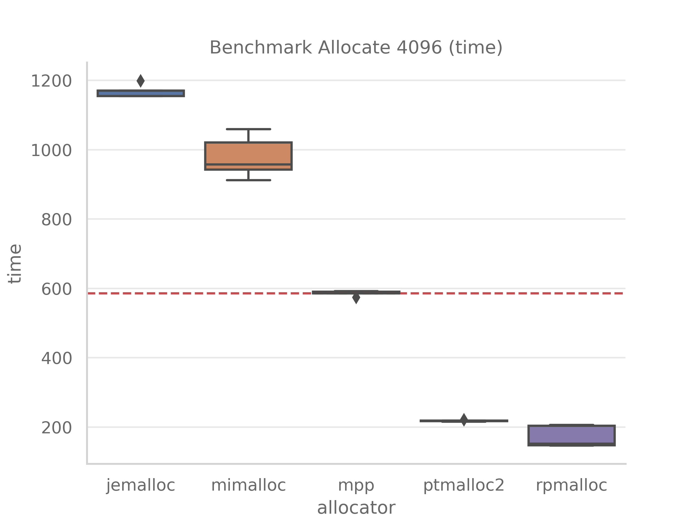
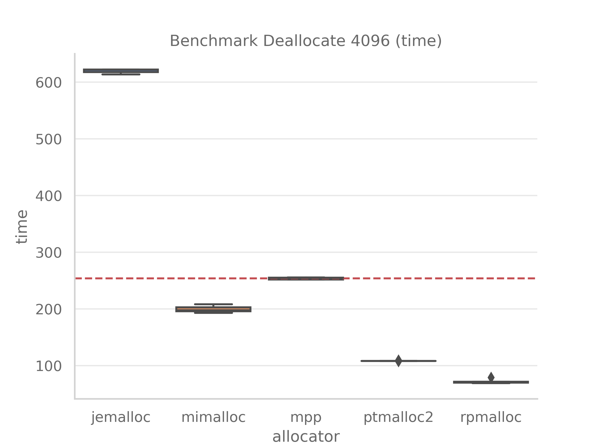
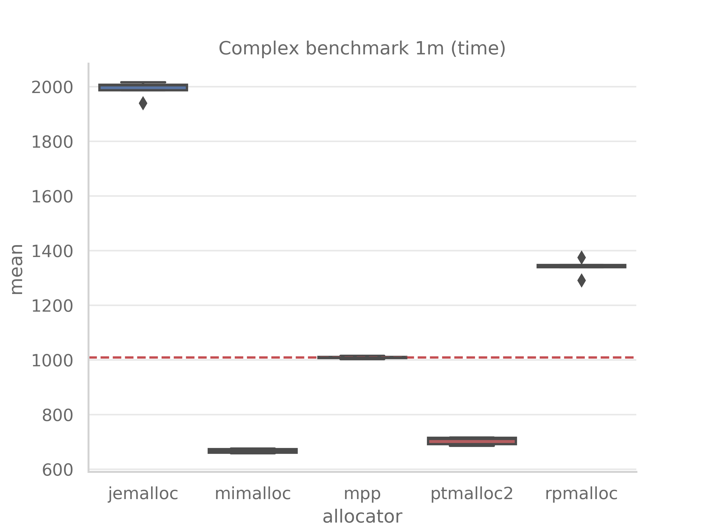
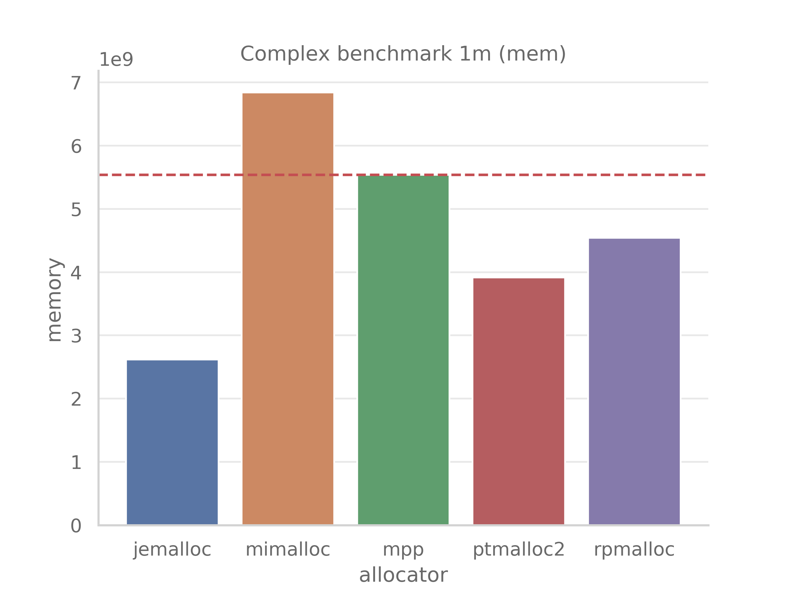
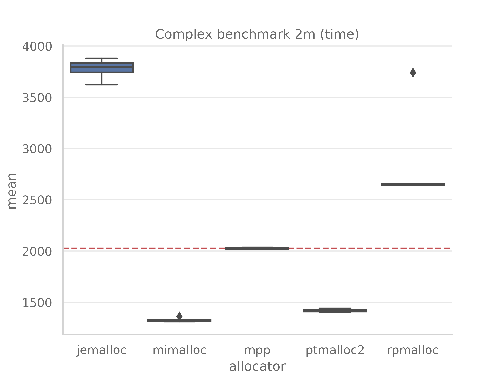
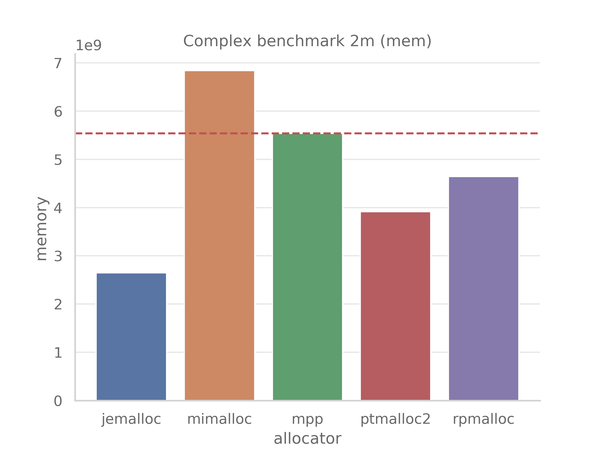
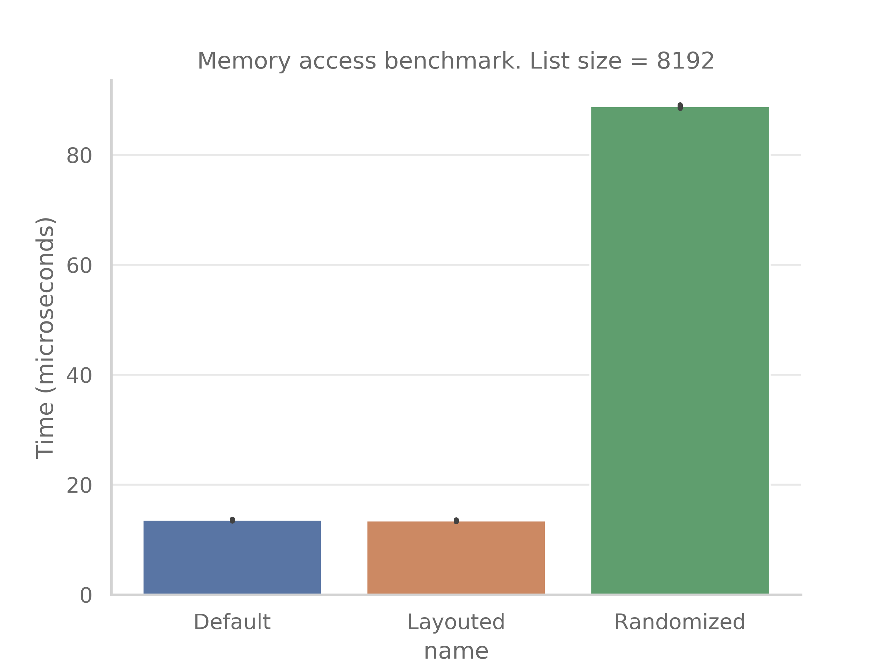
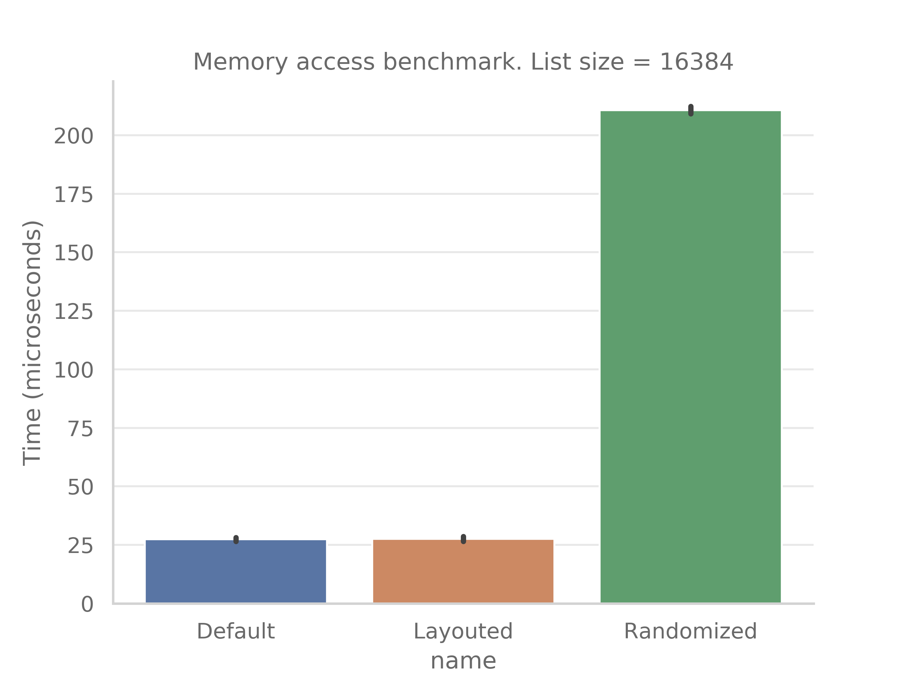

# memplusplus-benchmarks

## What is it

This repo provides a set of different benchmarks for [memplusplus](https://github.com/m4drat/memplusplus/) memory allocator. Each test benchmarks a wide range of functionality starting from simple allocation/deallocation speed and ending with some complex things (such as speed of data access after heap compacting/relayouting).

### How to run

1. Clone this repo: `git clone https://github.com/m4drat/memplusplus-benchmarks --recurse-submodules`
2. Run all benchmarks `cd memplusplus-benchmarks && ./compile_all_and_run.sh.sh`

### Benchmarks description and results

1. `benchmark_alloc.cpp` - Sequence of allocations from the same size bucket

    __Time spent to allocate 4096 objects of random size in us:__
    

    
    

2. `benchmark_alloc_dealloc.cpp` - Allocations and immediate deallocations
3. `benchmark_dealloc.cpp` - Sequence of chunks deallocations from the same size bucket

    __Time spent to deallocate 4096 objects of random size in us:__
    

    
    

4. `benchmark_complex.cpp` - Emulates a complex workload with allocations, deallocations and data access. This test is the most complex one and it is the most representative of real-world workloads. Benchmark inspired by [rpmalloc-benchmark](https://github.com/mjansson/rpmalloc-benchmark/)

    __Time spent to perform 1m operations (approx. 0.5m allocations, 0.5m deallocations) in ms:__
    

    
    

    __Peak memory usage__
    

    
    

    __Time spent to perform 2m operations (approx. 1m allocations, 1m deallocations) in ms:__
    

    
    

    __Peak memory usage__
    

    
    

5. `benchmark_memory_access.cpp` - Data access speed before/after compacting (only for `memplusplus`)

    __First column__ - optimally layouted and accessed linked list  
    __second column__ - randomized linked list, but after layouting  
    __third column__ - randomized linked list

    __Time spent to iterate over linked list of size 8192 in us:__
    

    
    

    __Time spent to iterate over linked list of size 16384 in us:__
    

    
    

### Targets

- [x] gcpp
- [x] jemalloc
- [x] mempp
- [x] mimalloc
- [?] ptmalloc2 - latest (glibc 2.36), currently uses `libc 2.31 (from my machine)`
- [x] ptmalloc3
- [x] rpmalloc
